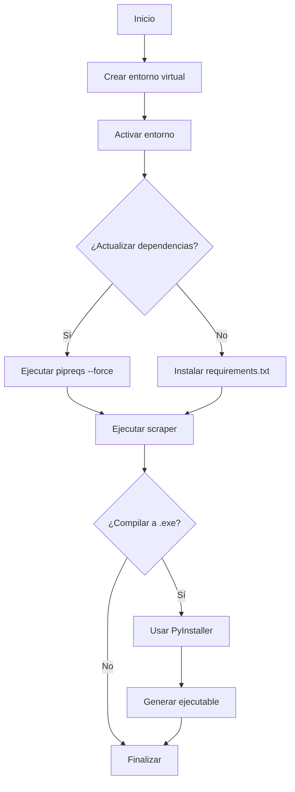
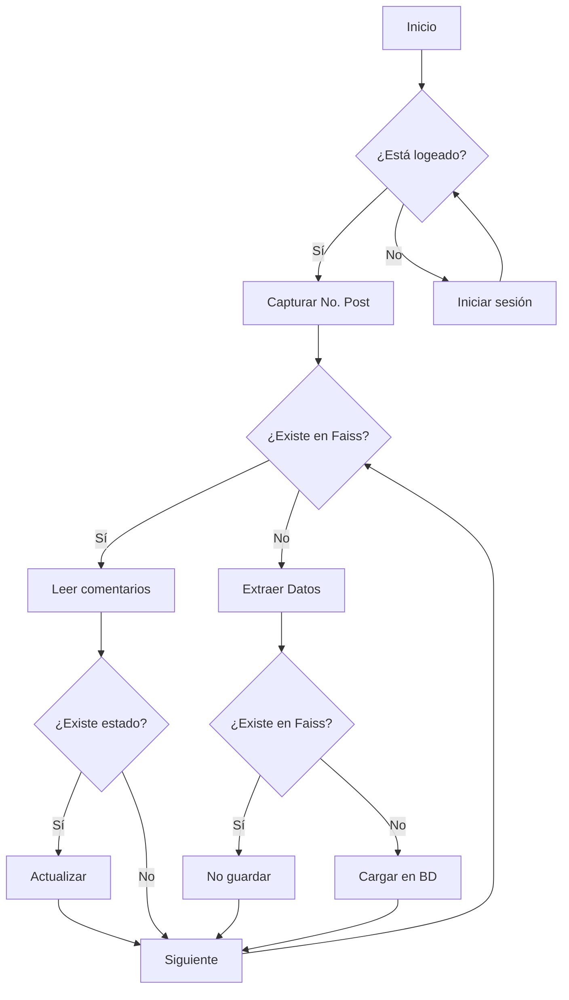

# Guía para configurar un contenedor de scraping con Docker

## 📋 Requisitos y configuración inicial

### 1. Instalar dependencias

#### Windows

```bash
python -m venv venv; venv\Scripts\activate; pip install -r requirements.txt
```

#### Linux

```bash
python -m venv venv; source venv/bin/activate; pip install -r requirements.txt
```

### 2. Generación de clave de encriptación

```bash
from cryptography.fernet import Fernet

# Generar nueva clave (ejecutar en consola Python)
new_key = Fernet.generate_key().decode('utf-8')
print(f"CLAVE GENERADA: {new_key}")
```

### 3. Configuración de variables de entorno

Crea un archivo `.env` basado en `example` con esta estructura:

```bash
# Credenciales de Eco (obligatorias)
USERS_ECO=usuario A,usuario B
PASSWDS_ECO=contra usuario A,contra usuario B

# Configuración del navegador (True = modo invisible, False = mostrar)
HEADLESS=True or False

# Configuración bot de telegram
TELEGRAM_TOKEN=Token de bot en telegram
TELEGRAM_CHAT=id usuario
```

### Actualizar dependencias (Solo desarrollo)

```bash
python -m venv venv; venv\Scripts\activate; pip install pipreqs; pipreqs . --force
```

### Herramientas

#### Descomprimir

##### Windows

```bash
Expand-Archive -Path offline_packages.zip -DestinationPath packages
```

##### Linux

```bash
unzip offline_packages.zip -o packages
```

#### Comprimir

##### Windows

```bash
Compress-Archive -Path .\offline_packages\* -DestinationPath offline_packages.zip -CompressionLevel Optimal

# ó
Compress-Archive -Path * -DestinationPath offline.zip -CompressionLevel Optimal
```

##### Linux

```bash
zip -9 -r offline_packages.zip ./offline_packages/
```

#### Eliminar archivo

##### Windows

```bash
Remove-Item -Recurse -Force packages
```

##### Linux

```bash
rm -fr packages
```

#### Permitir ejecucion

##### Windows

```bash
Set-ExecutionPolicy -Scope CurrentUser -ExecutionPolicy RemoteSigned
```

#### Modo Offline

##### Instalar

```bash
pip install --no-index --find-links packages -r requirements.txt
```

##### Generar

```bash
pip download -r requirements.txt -d ./offline_packages --only-binary :all:
```

## 🛠️ Procesos de automatización

### Conversión de archivo *".py"* a ejecutable *".exe"*

```bash
py -m PyInstaller --icon="ruta-absoluta-archivo-ico" ruta-abosulta-main-proyecto

# Ejemplo:
python -m PyInstaller --icon="vendor/favicon.ico" main.py
```

#### 🚀 Opciones de compilación:

- `--onefile`: Genera un solo archivo ejecutable
- `--windowed`: Ejecución sin ventana de terminal

> **Nota**: Requiere `pip install pyinstaller pillow` y el reemplazo del key en el archivo helpers (linea 11)

🔧 **Herramienta útil**: [Complemento RPA para Firefox](https://addons.mozilla.org/en-US/firefox/addon/rpa/)

---

## 📂 **Estructura del Proyecto**

```

/core
  ├── /controller            # Lógica de negocio
  │   ├── utils              # Metodos reutilizables o compartidos
  ├── /vendor                # Contiene archivos temp, imagenes, txt
```

## 🔄 Diagrama de Ejecución



## 🔄 Diagrama del Flujo del Scraper



#### 💡 **Creditos**

[Plantilla base](https://github.com/villalbaluis/arquitectura-bots-python) proporcionada por [Luis Villalba](https://github.com/villalbaluis)